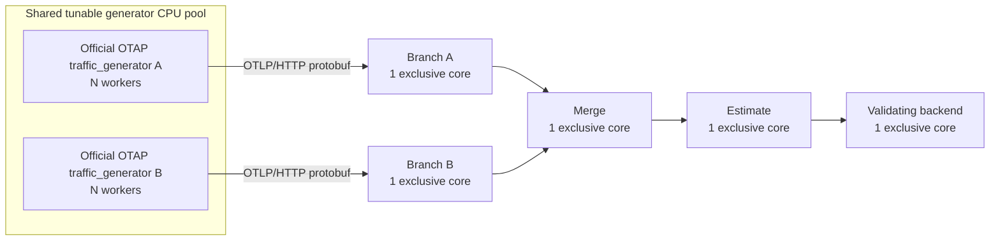

# Sustainable throughput and speedup experiment design

## Purpose

The experiment measures how much validated input each pipeline can sustain with the same CPU, memory, transport, batch, window, and input data constraints. Its primary comparison is KLL against exact aggregation. Raw is the transport ceiling and is not an equivalent quantile algorithm.

A throughput ratio at one offered load is descriptive only. The reported speedup is the ratio between maximum sustainable capacities.

## Fixed architecture



The five downstream components use distinct cores outside the generator pool. Every container has the same memory limit. Data uses uncompressed OTLP/HTTP protobuf over persistent TCP connections. Control traffic uses a separate Docker network and is excluded from data-interface counters.

## Independent variables

- Offered traffic per source: 10k, 25k, 50k, 100k, 200k, 300k, and 400k signals/s by default. The 400k point brackets the optimized KLL capacity observed near 300k/source.
- Aggregation window per source: 16,384, 65,536, and 262,144 observations.
- Scenario: raw, exact, or KLL.

Generator cores, batch size, link cap, memory limit, warm-up, and observation duration are recorded controls. A comparison is valid only within the same control configuration.

## Measurements

Throughput is completed paired windows times two sources times window size, divided by the backend observation interval. HTTP acceptance and unmatched source tails do not count.

For every run the harness records:

- offered and backend-validated signals/s;
- delivery ratio: validated throughput divided by offered traffic;
- backlog at both observation boundaries and backlog growth in paired-window units;
- completed-window p50 and p99 latency;
- validation failures and unmatched drain tail;
- CPU, RSS, and data-plane RX/TX for all seven components.

## Sustainable point

A configuration is sustainable when the median across repetitions satisfies all of these conditions:

1. delivery ratio is at least 0.95;
2. backlog grows by no more than one paired window during observation;
3. completed-window p99 latency is at most 5,000 ms;
4. every repetition passes end-to-end correctness validation.

The thresholds are explicit CLI options. The default run uses three repetitions and reports medians. A rate grid should include at least one sustainable and one unsustainable point for exact and KLL; extend the grid when a capacity boundary is not bracketed.

## Capacity and speedup

For scenario `S` and window `W`:

```text
capacity(S, W) = highest median backend-validated throughput among sustainable offered-load points
```

The primary result is:

```text
KLL/Exact capacity speedup(W) = capacity(KLL, W) / capacity(Exact, W)
```

`capacity.json` and `capacity.csv` contain this result. `summary.json` retains achieved throughput ratios at every offered load so reviewers can inspect the full curve.

Raw capacity is reported as the transport ceiling. `KLL/Raw` may describe how closely KLL approaches that ceiling, but it is not called an algorithm speedup because raw does not compute quantiles.

## Presentation

The report must show:

1. offered load versus backend-validated throughput, with the ideal `y=x` line;
2. the sustainable/unsustainable classification for every point;
3. maximum sustainable capacity and KLL/Exact capacity speedup per window;
4. per-component CPU, RSS, RX/TX, backlog growth, and p99 latency at the capacity boundary.

A capacity claim uses the nightly three-repetition, 30-second measurements. Short local smoke runs verify implementation and artifact generation but do not establish the final speedup.

## Interpretation

At saturation, the component CPU plot identifies the limiting stage. A component need not consume a full core for the pipeline to be unsustainable: synchronization, bounded queues, transport waits, or multiple stages can constrain capacity. CPU limits, achieved load, backlog, latency, and correctness must therefore be interpreted together.
