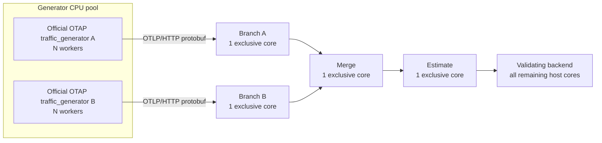

# Throughput and resource-efficiency experiment design

## Purpose

This experiment evaluates KLL-based approximate quantile aggregation against exact aggregation along two dimensions:

1. **Resource efficiency at the same workload:** how much CPU and memory each pipeline requires to process the same input rate.
2. **Capacity under the same resource budget:** how much validated input each pipeline can sustain with the same downstream CPU and memory allocation.

Raw forwarding is reported separately as a transport ceiling. It is not an equivalent quantile algorithm and is therefore not used for the primary Exact/KLL comparison.

## Fixed architecture



The **evaluated pipeline** consists of:

```text
Branch A + Branch B + Merge + Estimate
```

Each evaluated component receives one exclusive CPU core. Generator and backend resources are benchmark infrastructure: they are monitored to ensure they do not limit the experiment, but are excluded from pipeline CPU and memory comparisons. The backend receives all remaining host cores.

No container has a Docker memory limit. Sampled and lifetime peak RSS are reported per component. Data-plane communication uses uncompressed OTLP/HTTP protobuf over persistent TCP connections. Control traffic uses a separate Docker network and is excluded from data-plane counters.

KLL uses production `KLLWrapper` with fixed `k=400`.

## Independent variables

- **Offered traffic per source:** increased as needed to cover both matched-load points and each scenario's capacity boundary.
- **Aggregation window per source:** `16,384`, `65,536`, and `262,144` observations.
- **Scenario:** raw, exact, or KLL.

Batch size, transport configuration, warm-up, observation duration, and input values are controlled. Exact and KLL use identical values for these controls within a comparison.

## Measurements

For every run, the harness records:

- offered and backend-validated signals/s;
- delivery ratio;
- backlog at both observation boundaries;
- completed-window p50 and p99 latency;
- correctness failures and unmatched drain tail;
- per-component CPU and RSS;
- per-component data-plane RX/TX.

Throughput is computed from completed paired windows:

```text
validated throughput =
    completed paired windows
    × 2 sources
    × observations/source/window
    / observation interval
```

HTTP acceptance and unmatched source tails do not count as completed work.

Pipeline resource usage includes only:

```text
branch_a + branch_b + merge + estimate
```

Generator and backend measurements are retained for bottleneck validation but excluded from resource-efficiency results.

---

## Experiment A: Same workload → resource efficiency

### Goal

Measure how much pipeline CPU and memory Exact and KLL require to process the **same workload**.

### Fairness constraints

For each Exact/KLL comparison, hold constant:

- offered traffic;
- aggregation window size;
- input values;
- batch size;
- transport configuration;
- CPU placement;
- uncapped container memory;
- warm-up and observation duration;
- generator configuration.

The selected offered load must be sustainable for **both** Exact and KLL. This prevents resource comparisons from mixing a stable pipeline with an overloaded one.

### CPU efficiency

Pipeline CPU is:

```text
pipeline_cpu =
    cpu(branch_a)
    + cpu(branch_b)
    + cpu(merge)
    + cpu(estimate)
```

Report both absolute CPU consumption and normalized CPU cost:

```text
core-seconds per million validated signals =
    pipeline_cpu / (validated_throughput / 1,000,000)
```

The normalized metric captures the CPU required to perform the same amount of validated work.

### Memory efficiency

Report RSS separately for branch, merge, and estimate stages, together with aggregate pipeline RSS:

```text
pipeline_rss =
    rss(branch_a)
    + rss(branch_b)
    + rss(merge)
    + rss(estimate)
```

The primary memory comparison is performed at matched offered load.

Memory is also reported across window sizes to show how aggregation state scales with increasing window size.

Generator and backend RSS are excluded because they do not represent aggregation state.

### Primary resource-efficiency results

For each window size, report:

| Window | Scenario | Offered load | Validated throughput | Pipeline CPU | Core-s / M signals | Pipeline RSS |
| ---: | --- | ---: | ---: | ---: | ---: | ---: |
| 16,384 | Exact | same | ... | ... | ... | ... |
| 16,384 | KLL | same | ... | ... | ... | ... |
| 65,536 | Exact | same | ... | ... | ... | ... |
| 65,536 | KLL | same | ... | ... | ... | ... |
| 262,144 | Exact | same | ... | ... | ... | ... |
| 262,144 | KLL | same | ... | ... | ... | ... |

The matched offered load should be chosen below the lower of the Exact and KLL sustainable-capacity boundaries for that window.

---

## Experiment B: Same resource budget → capacity

### Goal

Measure how much traffic Exact and KLL can sustain with the **same evaluated pipeline resources**.

The fixed downstream budget is:

```text
Branch A   = 1 exclusive core
Branch B   = 1 exclusive core
Merge      = 1 exclusive core
Estimate   = 1 exclusive core
```

All containers have uncapped memory; actual RSS is measured per component.

Offered traffic is increased independently for each scenario until its sustainable-capacity boundary is bracketed.

### Sustainable point

A configuration is sustainable when the median across repetitions satisfies all of the following:

1. delivery ratio is at least `0.95`, allowing at most one completed-window quantization interval at the observation boundary;
2. backlog grows by no more than one paired window during observation;
3. completed-window p99 latency is at most the larger of `5,000 ms` and twice the theoretical `window size / offered rate` fill time;
4. every repetition passes end-to-end correctness validation.

Observation time is extended beyond 30 seconds when necessary to cover at least three windows.

The default experiment uses three repetitions and reports medians.

The offered-load sweep must contain at least one sustainable and one unsustainable point around the capacity boundary. The grid is extended when necessary.

### Capacity

For scenario `S` and window `W`:

```text
capacity(S, W) =
    highest median backend-validated throughput
    among sustainable offered-load points
```

The primary capacity result is:

```text
KLL/Exact capacity speedup(W) =
    capacity(KLL, W) / capacity(Exact, W)
```

`capacity.json` and `capacity.csv` contain the resulting capacity boundaries. `summary.json` retains all offered-load points so the complete throughput curve remains inspectable.

### Generator provisioning

The generator is outside the evaluated resource budget.

Generator cores may therefore be increased when necessary to drive the evaluated pipeline to saturation. The report records the generator configuration used for every point.

A capacity result is valid only when the generator is demonstrably not the limiting resource. Increasing generator resources should not materially increase validated throughput once the downstream plateau has been reached.

Generator CPU and memory are not included in the Exact/KLL resource or capacity ratios.

### Backend

The backend receives all remaining host CPU cores and has uncapped memory. It validates correctness and counts completed paired windows. Its CPU and memory are also outside the evaluated pipeline budget.

Backend utilization is monitored to verify that validation does not become the throughput bottleneck.

---

## Raw transport baseline

Raw forwarding is evaluated separately to characterize the transport and serialization ceiling.

Raw results answer:

```text
How much traffic can this benchmark topology transport without quantile computation?
```

They do not answer:

```text
How much faster is KLL than another quantile algorithm?
```

Therefore `KLL/Raw` may be reported as proximity to the transport ceiling, but it is not reported as an algorithmic speedup.

---

## Presentation

The primary report should contain four results.

### 1. Throughput curve

Plot:

```text
x = offered traffic
y = backend-validated throughput
series = Exact, KLL
```

Include the ideal `y=x` line and mark sustainable and unsustainable points.

### 2. Sustainable capacity

Report:

| Window | Exact capacity | KLL capacity | KLL / Exact |
| ---: | ---: | ---: | ---: |
| 16,384 | ... | ... | ... |
| 65,536 | ... | ... | ... |
| 262,144 | ... | ... | ... |

This is the primary performance result.

### 3. CPU efficiency at matched load

Plot or report:

```text
x = window size
y = pipeline core-seconds / million validated signals
series = Exact, KLL
```

This is the primary CPU-efficiency result.

### 4. Memory at matched load

Plot:

```text
x = window size
y = pipeline peak RSS
series = Exact, KLL
```

Also retain the per-component breakdown to distinguish branch state from merge and estimate state.

This is the primary memory-efficiency result.

Detailed per-component CPU, RSS, RX/TX, backlog, and latency remain available in the generated benchmark artifacts rather than being required in the main summary.

## Interpretation

The two experiments answer different questions and should not be mixed.

**Matched workload** answers:

```text
For the same amount of input work, how many resources does each approach consume?
```

**Matched resource budget** answers:

```text
With the same aggregation resources, how much work can each approach sustain?
```

CPU or RSS measured at each scenario's independently selected throughput peak must not be used as evidence of lower resource consumption, because those points represent different workloads.

At saturation, per-component CPU, backlog, and latency are used to identify the limiting stage. A pipeline may become unsustainable without every component reaching one full core because synchronization, queues, transport, or interactions across stages may constrain capacity.
