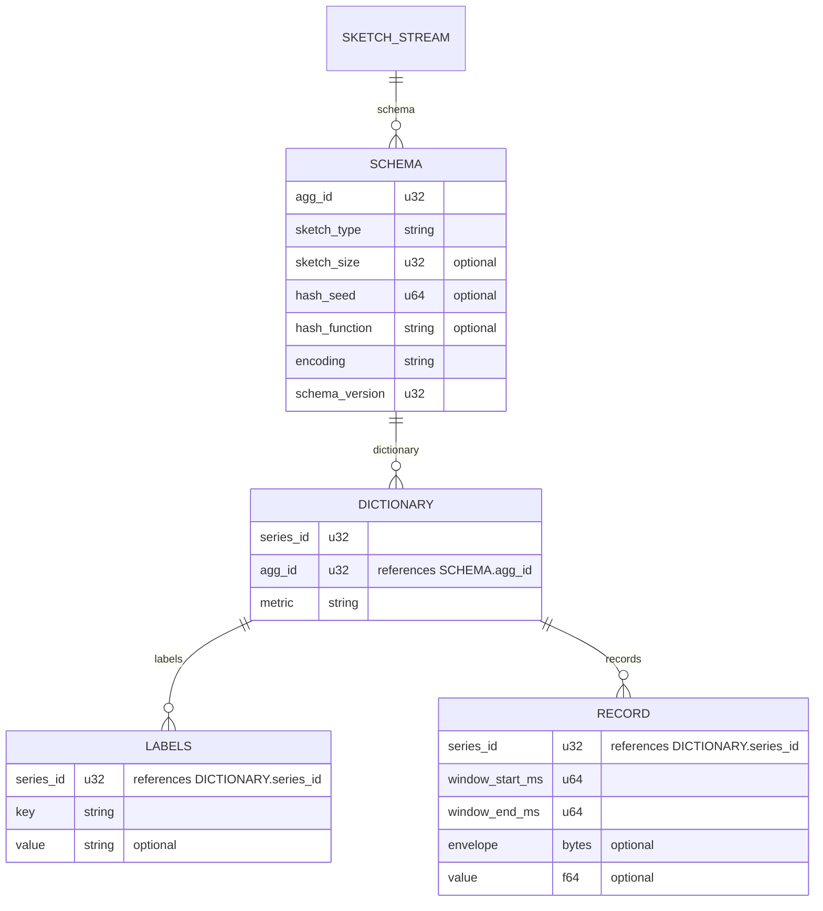

# Sketch Envelope Data Model

This document describes the information carried when sketch state
(DDSketch, KLL, HLL, Count Sketch, Count-Min Sketch) crosses a node or
network boundary between `asap_sketches` processor instances.

A `RECORD` carries one of two things for a given series and window: sketch
state (an `envelope` — a full snapshot or a delta) or an estimate (a
quantile or cardinality `value`), never both.

## The OTAP analogy: Schema / Dictionary / Record

OTAP's metrics IPC format splits a stream into three constructs, each with a
different reason to exist and a different natural update frequency:

- **Schema** — the structural + semantic contract for the whole stream:
  column layout, types, and any config-level facts needed to interpret every
  record the same way. Established once, changes only when the producer's
  configuration or protocol version changes. Nothing here is "data" — it's
  the rules for reading data.
- **Dictionary** — a bounded, slowly-growing set of distinct values that
  *repeat* across many records over the life of the stream (attribute keys,
  attribute values, names). Sent once per distinct value, referenced by a
  small index afterward; new entries are appended as deltas as they first
  appear. The defining property is **reuse**: a dictionary only pays off for
  values that recur identically across many records.
- **Record** — the actual per-row payload. The only tier whose transmission
  cost is meant to scale with row count; everything that is genuinely unique
  per row belongs here, and nothing else should.

The point of separating them is that each construct is optimized for a
different *rate of change*. Putting a config-level fact in the Record tier
means paying its cost on every row forever; putting a truly per-row fact in
the Schema tier means it can't vary when it needs to.

## Mapping sketch-envelope fields onto Schema / Dictionary / Record

Applying "what's common across sketch instances, and across summarized
series" as the separating question, at each of three distinct timescales:

| Timescale | Common across... | Fields | OTAP-equivalent tier |
|---|---|---|---|
| **Config-time** (changes only on redeploy/reconfig) | every sketch instance, and every summarized series | `sketch_type`; sketch configuration/parameters (sketch size, hash seed, hash function); `encoding`; `schema_version` | **Schema** — this is the contract for decoding *any* envelope byte, not data about one. |
| **Series-lifetime** (fixed for one series, differs series to series) | every instance of *one* summarized series, but not across different series | `metric` name + `labels` (the aggregated attributes identifying the series) | **Dictionary** — a bounded, slowly-growing set of distinct (name, label-set) identities, each reused across every window that series produces. |
| **Sketch-instance-lifetime** (unique per sketch instance — the OTAP analogy to a row) | nothing — genuinely one-off | `window_start_ms` / `window_end_ms`; `envelope` bytes; `value` (estimate scalar) | **Record** — the only tier whose cost should scale with row count. |

`window_start_ms` / `window_end_ms` belongs on `RECORD`, not on some
separate batch-level tier: a sketch instance accumulates raw metric samples
over its own window as they arrive, so the window bounds describe *that
one instance's* accumulation period — every sketch instance closes (and
gets flushed) on its own, independent of any other. It can *look* like a
shared, batch-level constant when a processor's tumbling-window rotation
happens to close many series at once and emit them together with identical
bounds — but that's an artifact of how emission happens to be grouped, not
a property of the data itself; a scheme that closed each series' window on
an independent schedule would still have this field behave the same way,
one value per sketch instance.

`agg_id` sits at the boundary between Schema and Dictionary: it's really a
join key back to a Schema-tier config (which sketch parameters apply), so
conceptually it belongs with `sketch_type` — but because in principle
several concurrent aggregation plans can share one stream, it behaves like a
(very low-cardinality) dictionary of "which config" until a stream is known
to carry exactly one.

## Schema / Dictionary / Record as entities

The same split, drawn as an ER diagram: `SCHEMA` is keyed by `agg_id` (one
per aggregation plan, usually but not necessarily one per stream),
`DICTIONARY` is the slowly-growing set of distinct series identities, and
`RECORD` is one row per sketch instance — emitted each time a series'
window closes — referencing a dictionary entry by `series_id` rather than
repeating `metric`/`labels` inline, the same way
OTel-Arrow's own attribute tables reference their parent by `parent_id`
instead of repeating the parent row's fields.

### Worked example: `agg_id` vs `series_id`

Say one aggregation plan is running: `agg_id = 7`, configured as
`sketch_type=DDSketch, relative_accuracy=0.01, window=10s,
output_metric_name="http_request_duration"`. That configuration *is* the
one `SCHEMA` row — the recipe: which algorithm, which parameters, which
window size.

Requests arrive tagged with different label combinations. Each distinct
combination is tracked separately — that's what "aggregate per series"
means — so each gets its own `DICTIONARY` entry, its own `series_id`:

| series_id | labels | agg_id |
|---|---|---|
| 101 | `path=/api, region=us-east` | 7 |
| 102 | `path=/api, region=us-west` | 7 |
| 103 | `path=/login, region=us-east` | 7 |

All three share `agg_id = 7` — same recipe — but each has a different
`series_id`, because they're different time series. At the first window's
flush this produces three `RECORD` rows, one per `series_id`, each carrying
that window's `envelope` bytes. At the *next* window's flush, the same
three series reuse `series_id` 101/102/103 unchanged — no new `DICTIONARY`
entry needed, just new `RECORD` rows with a fresh `envelope` and window
bounds. A new `DICTIONARY` entry only gets created the first time a label
combination is seen — e.g. the first request tagged `path=/checkout` gets a
brand-new `series_id = 104`.

So: `agg_id` identifies **which recipe** produced a series — shared by
every series that recipe aggregates, and only changes when the config
changes. `series_id` identifies **which specific series** — one per
distinct label combination, with a new one appended only when that
combination is first seen.

Now suppose a stream carries *two* concurrent plans: `agg_id = 7`
(DDSketch, accuracy 0.01) and `agg_id = 8` (DDSketch, accuracy 0.001). A
request tagged `path=/api, region=us-east` aggregated under plan 7, and the
*same* labels aggregated under plan 8, are not the same series — they're
two independently-maintained sketches with different accuracy, so they get
two different `series_id`s, each pointing back to its own `agg_id`. That's
why the diagram draws `SCHEMA` as one-to-many per stream rather than a
strict singleton, and why `agg_id` lives on `DICTIONARY` rather than on
`RECORD`: it only needs to be recorded once, at the moment a `series_id` is
created. Every later `RECORD` row for that `series_id` already implies
which `agg_id`/`SCHEMA` it belongs to — transitively, without repeating the
value.

`SCHEMA` is sent once per distinct `agg_id` and never repeated after that.
`DICTIONARY` (+ its child `LABELS`) is sent incrementally — only a new
`series_id` entry costs anything; every later `RECORD` for that series just
carries the existing `series_id`, which transitively implies both its
identity and its schema. `RECORD` is the only entity whose row count scales
with actual observations, and its own fields
(`window_start_ms`/`window_end_ms`, `envelope`, `value`) are exactly the
ones that never repeat identically across rows: each sketch instance closes
its own accumulation window independently, so the window bounds belong to
that one `RECORD`, not to the series' `DICTIONARY` entry, which persists
across many such windows.

## Aside: OTAP's multivariate metrics — a different redundancy axis

OTAP has no native multivariate metric representation today — its metrics
table is literally named `UNIVARIATE_METRICS`
([otel-arrow data model](https://github.com/open-telemetry/otel-arrow/blob/main/docs/data_model.md)),
a name chosen to leave room for a `MULTIVARIATE_METRICS` counterpart that
hasn't landed. The idea traces back to
[OTEP 156](https://github.com/open-telemetry/oteps/blob/main/text/0156-columnar-encoding.md),
the columnar-encoding proposal OTAP itself grew out of; a concrete schema
for it was sketched — and closed as "not planned" — in
[otel-arrow#14](https://github.com/open-telemetry/otel-arrow/issues/14).
Nothing below is being adopted; it's worth spelling out because it names a
real redundancy that is *not* the one Schema/Dictionary/Record above is
built around.

### What "multivariate" means

OTEP 156 borrows the term from statistics: *"A multivariate time series has
more than one time-dependent variable... A 3-axis accelerometer reporting 3
metrics simultaneously; a mouse move that simultaneously reports the values
of x and y; a meteorological weather station reporting temperature, cloud
cover, dew point, humidity and wind speed; an HTTP transaction characterized
by many interrelated metrics sharing the same attributes are all common
examples of multivariate time-series."*

That's a description of an **application-layer phenomenon** — several
distinct, correlated measurements produced at the same instant, under the
same attribute set — not a data structure OTLP or OTAP provides today. Each
of those measurements has to become its own independent
`UNIVARIATE_METRICS` row, repeating the same `attrs` and `time_unix_nano`
once per metric name:

| metric | attrs | ts | value |
|---|---|---|---|
| `cpu.idle` | `host=A, region=us-east` | 1000 | 80.0 |
| `cpu.user` | `host=A, region=us-east` | 1000 | 15.0 |
| `cpu.sys`  | `host=A, region=us-east` | 1000 | 5.0 |

A hypothetical multivariate representation collapses that into one row keyed
by `(attrs, ts)`, with one column per metric — "same dimension, same
instant" merged into one wide row instead of each metric name opening a
fully independent stream that each repeats `attrs`:

| attrs | ts | `cpu.idle` | `cpu.user` | `cpu.sys` |
|---|---|---|---|---|
| `host=A, region=us-east` | 1000 | 80.0 | 15.0 | 5.0 |

### Two different redundancy axes

- **Multivariate's axis is cross-sectional**: at *one instant*, several
  *different, independently-named* metrics share the same
  `(attrs, timestamp)` pair. The waste is re-sending that identical pair
  once per sibling metric.
- **Schema/Dictionary/Record's axis is temporal, at two different rates**:
  sketch configuration (`sketch_type`, size/hash params, `encoding`) recurs
  across *every series and every window* an `agg_id` ever produces —
  config-time reuse, deduplicated once into `SCHEMA`; series identity
  (`metric` name + label combination) recurs across *every window that one
  series* produces — series-lifetime reuse, deduplicated once into
  `DICTIONARY`. Both are things that would otherwise repeat on every
  `RECORD` row if not split out (see the timescale table earlier in this
  doc); `RECORD` carries only what's actually unique to one instant
  (`window_start_ms`/`window_end_ms`, `envelope`/`value`), and `agg_id`
  / `series_id` are references back to identities that were only ever
  sent once each.

| | OTAP multivariate | ASAP Schema/Dictionary/Record |
|---|---|---|
| Axis of reuse | cross-sectional — same instant, different metrics | temporal — same config / same series, different instants |
| What repeats today | `attrs` + `timestamp`, once per sibling metric name | sketch config metadata, once per series *and* per window; `metric` + `labels` (series identity), once per window |
| Collapse mechanism | N rows → 1 row, N value columns | config repeated across series/windows → 1 `SCHEMA` row (`agg_id`); identity repeated across windows → 1 `DICTIONARY` row (`series_id`) |
| Unit of a "row" | one observation instant, across several metrics | one sketch instance — one series' one window |

So: this doc's design is squarely the temporal case — sketch config and
series identity both recurring across time at their own rates, which is
exactly what `SCHEMA`/`agg_id` and `DICTIONARY`/`series_id` exist to
deduplicate. Whether some *other, differently-named* metric happens to
share a timestamp and attribute set with a given sketch's series has no
bearing on that design; the two axes are orthogonal.

## Field reference

### `SCHEMA` — one per `agg_id`

| Field | Type | Role |
|---|---|---|
| `agg_id` | u32 | Primary key. Identifies this recipe — the aggregation plan/config. |
| `sketch_type` | string | Which algorithm: DDSketch / KLL / HLL / Count Sketch / Count-Min Sketch. |
| `sketch_size` | u32, optional | The algorithm's size/accuracy parameter (relative accuracy, buffer size, width × depth — whichever applies). |
| `hash_seed` | u64, optional | Determinism contract for hash-based sketches (HLL, Count Sketch, Count-Min Sketch), so independently-produced sketches for the same series can merge correctly. |
| `hash_function` | string, optional | Which hash function, for algorithms that need one. |
| `encoding` | string | Wire layout of every `RECORD.envelope` under this schema: proto or msgpack, full or delta. |
| `schema_version` | u32 | Wire-schema version, for forward/backward compatibility across deploys. |

`sketch_type` decides what `sketch_size` (and whether `hash_seed` /
`hash_function` apply) actually means:

| `sketch_type` | What `sketch_size` holds | Example | `hash_seed` / `hash_function` |
|---|---|---|---|
| DDSketch | Relative accuracy (α) | `0.01` | not used — bucket boundaries are computed directly from the value, no hashing involved |
| KLL | Buffer size (`k`) | `200` | not used — KLL stores/compacts items directly; it has no hashing step (a separate, optional compaction seed exists to make its internal randomized compaction reproducible, but that's not this field) |
| HLL | Precision — register-count exponent, 4–18 | `12` | used — every value must hash to the same register on every host, or merging two sketches (max-per-register) overcounts the true union |
| Count Sketch | Width × depth | `2048 × 4` | used — sketch is hash-based, so both sides need the same seed/function to merge correctly |
| Count-Min Sketch | Width × depth | `2048 × 4` | used — same reason as Count Sketch |

### `DICTIONARY` — one per distinct series, within one `agg_id`

| Field | Type | Role |
|---|---|---|
| `series_id` | u32 | Primary key. Identifies this series. |
| `agg_id` | u32 | Which `SCHEMA` this series belongs to. |
| `metric` | string | Metric name. |

Continuing the `agg_id = 7` example — each distinct label combination seen
so far gets its own row, including `series_id = 104` the moment
`path=/checkout` is first observed:

| series_id | agg_id | metric |
|---|---|---|
| 101 | 7 | `http_request_duration` |
| 102 | 7 | `http_request_duration` |
| 103 | 7 | `http_request_duration` |
| 104 | 7 | `http_request_duration` |

### `LABELS` — one row per label key, per series

| Field | Type | Role |
|---|---|---|
| `series_id` | u32 | Which `DICTIONARY` entry this label belongs to. |
| `key` | string | Label key, e.g. `region`, `path`. |
| `value` | string, optional | Label value. |

Same four series — two label rows apiece, since each series has two label
keys (`path`, `region`):

| series_id | key | value |
|---|---|---|
| 101 | path | `/api` |
| 101 | region | `us-east` |
| 102 | path | `/api` |
| 102 | region | `us-west` |
| 103 | path | `/login` |
| 103 | region | `us-east` |
| 104 | path | `/checkout` |
| 104 | region | `us-east` |

### `RECORD` — one per series, per flush

| Field | Type | Role |
|---|---|---|
| `series_id` | u32 | Which `DICTIONARY` entry (and, transitively, which `SCHEMA`) this record belongs to. |
| `window_start_ms` / `window_end_ms` | u64 | The time window this record summarizes. |
| `envelope` | bytes, optional | The serialized sketch or sketch-delta. Opaque without the series' `SCHEMA` to interpret it. |
| `value` | f64, optional | An estimate-mode result (a quantile or cardinality estimate), carried instead of `envelope` when the series emits estimates rather than sketch state. |

Continuing the `agg_id = 7` example above, across two successive 10s
windows for `series_id` 101/102/103, plus what an estimate-mode row for the
same series would look like instead:

| series_id | window_start_ms | window_end_ms | envelope | value |
|---|---|---|---|---|
| 101 | 1,000 | 11,000 | `<DDSketch bytes, /api us-east, window 1>` | — |
| 102 | 1,000 | 11,000 | `<DDSketch bytes, /api us-west, window 1>` | — |
| 103 | 1,000 | 11,000 | `<DDSketch bytes, /login us-east, window 1>` | — |
| 101 | 11,000 | 21,000 | `<DDSketch bytes, /api us-east, window 2>` | — |
| 102 | 11,000 | 21,000 | `<DDSketch bytes, /api us-west, window 2>` | — |
| 101 | 11,000 | 21,000 | — | `42.3` (p99, estimate mode instead of `envelope`) |

Same `series_id`, same window bounds each flush — only `envelope` (or
`value`) actually changes row to row; `series_id` itself is just a
lookup key, never re-derived from `metric`/`labels`.

## Open design questions

### Control plane vs. data plane: where does SCHEMA come from?

Everything above describes SCHEMA/DICTIONARY/RECORD as if they ride the
same stream. In practice SCHEMA is not negotiated on the data path at
all — the aggregation plan behind an `agg_id` (which `sketch_type`,
`sketch_size`, `encoding`) is decided out of band by whatever configures
the sketch processor. That's a control-plane concern, not a data-plane
one.

**OpAMP** is a natural fit for that control plane: it's already the
mechanism the OTel ecosystem uses to remotely configure collector
components. Under that model, an `agg_id`'s `SCHEMA` row is an
OpAMP-managed config artifact, pushed to a processor before it ever
emits a `RECORD` tagged with that `agg_id` — not something a receiver
learns from the stream itself.

That leaves the data plane (`SKETCH_STREAM → DICTIONARY → RECORD`)
responsible only for carrying `agg_id` as a join key back to a `SCHEMA`
the receiver is assumed to already have. Open question: should the data
plane ever be able to carry `SCHEMA` inline (self-describing, no
external config channel required), or is it acceptable to require the
control plane to have distributed `SCHEMA` out of band before any
`RECORD` referencing it can be interpreted?

### Where the Schema/Dictionary statefulness guarantee actually comes from

The reason "SCHEMA once, DICTIONARY incremental" saves anything is that
Arrow's **IPC format** keeps state across a stream: a decoder retains
the last Schema message and every Dictionary batch it has seen, and
later RecordBatches lean on that retained state instead of repeating
it. The real OTAP metrics mapping implemented by `otap/codec.rs` is:

| Sketch entity | Native OTAP representation |
|---|---|
| `SCHEMA` | Attributes of the aggregation plan's Resource |
| `DICTIONARY` / `LABELS` | Metric name plus attributes of the series' instrumentation Scope |
| `RECORD` | SummaryDataPoint + SummaryDpAttrs for sketch envelopes; NumberDataPoint for scalar estimates |

For a sketch `RECORD`, `SummaryDpAttrs["sketch.envelope"]` contains the
canonical sketchlib ASAPv1 bytes. The `b"ASAPv1"` magic number, envelope
version, kind ID, and length-prefixed metadata and payload make the binary
self-describing; the surrounding `sketch.*` Resource/Scope attributes provide
OTAP routing and indexing rather than being required to interpret the sketch.
Native OTAP sketch RECORDs require this full MessagePack envelope. Protobuf,
legacy unframed MessagePack, and bare delta frames are rejected at the carrier
boundary.

OTAP's `resource_id`, `scope_id`, metric `id`, and attribute `parent_id`
columns express the joins instead of repeating SCHEMA and series facts on
every data point. The processor also retains its series registry, so a series
keeps the same `series_id` across window flushes.

The current OTAP transport does preserve Arrow stream state. Its producer
retains one IPC writer and dictionary tracker per payload type, writes the
Arrow schema when that stream is created or its schema changes, and enables
dictionary-delta handling. Schema bytes and dictionary values are therefore
incremental over one continuous OTAP connection.

So the "established once, referenced by index thereafter" economics
this doc leans on are inherited from Arrow IPC decode semantics, and
only hold while that producer/consumer stream remains continuous. Each
`OtapPdata` is nevertheless independently joinable and includes the Resource
and Scope parent rows required by its metric records; those structural rows
cannot safely be omitted merely because an earlier message carried equivalent
parents. Reconnection, routing to another replica, or conversion through OTLP
starts a new schema/dictionary context without making an individual message
undecodable.
