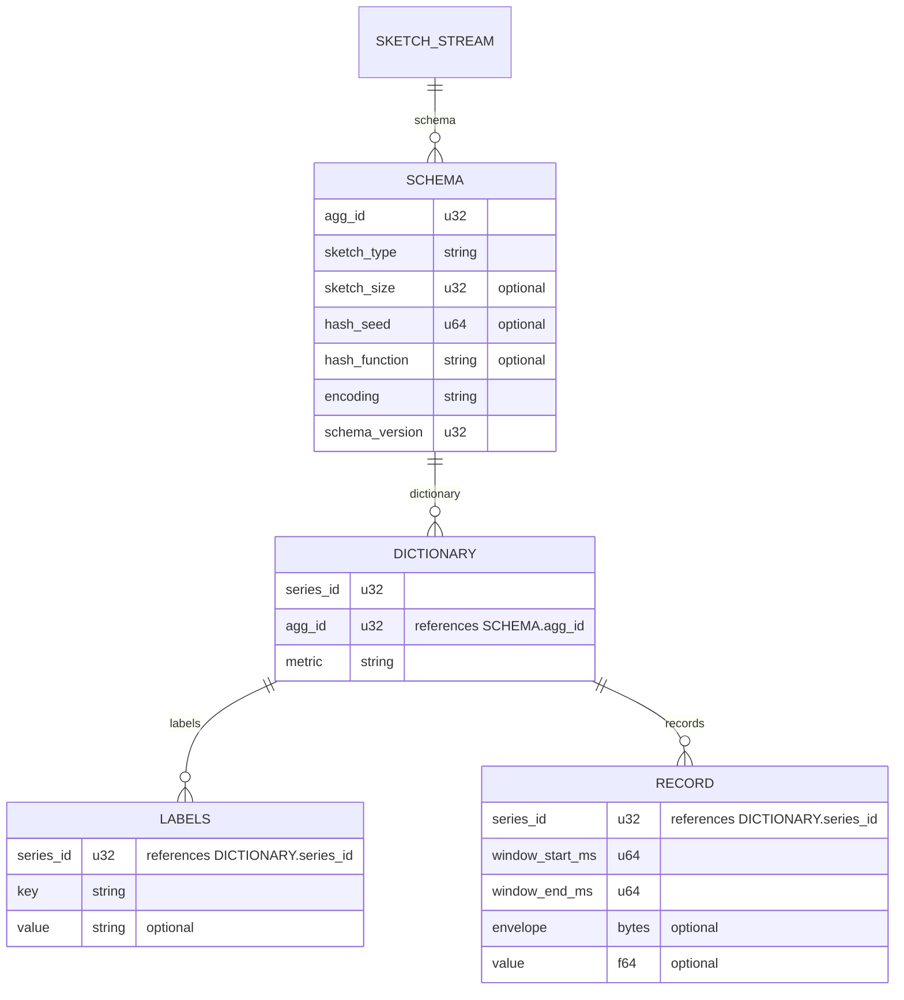

# Sketch Envelope Data Model

This document describes the information carried when sketch state
(DDSketch, KLL, HLL, Count Sketch, Count-Min Sketch) crosses a node or
network boundary between `asap_sketches` processor instances.

A `RECORD` carries one of two things for a given series and window: sketch
state (an `envelope` — a full snapshot or a delta) or an estimate (a
quantile or cardinality `value`), never both.

## The OTAP analogy: Schema / Dictionary / Record

OTAP's metrics IPC format splits a stream into three constructs, each with a
different reason to exist and a different natural update frequency:

- **Schema** — the structural + semantic contract for the whole stream:
  column layout, types, and any config-level facts needed to interpret every
  record the same way. Established once, changes only when the producer's
  configuration or protocol version changes. Nothing here is "data" — it's
  the rules for reading data.
- **Dictionary** — a bounded, slowly-growing set of distinct values that
  *repeat* across many records over the life of the stream (attribute keys,
  attribute values, names). Sent once per distinct value, referenced by a
  small index afterward; new entries are appended as deltas as they first
  appear. The defining property is **reuse**: a dictionary only pays off for
  values that recur identically across many records.
- **Record** — the actual per-row payload. The only tier whose transmission
  cost is meant to scale with row count; everything that is genuinely unique
  per row belongs here, and nothing else should.

The point of separating them is that each construct is optimized for a
different *rate of change*. Putting a config-level fact in the Record tier
means paying its cost on every row forever; putting a truly per-row fact in
the Schema tier means it can't vary when it needs to.

## Mapping sketch-envelope fields onto Schema / Dictionary / Record

Applying "what's common across sketch instances, and across summarized
series" as the separating question, at each of four distinct timescales:

| Timescale | Common across... | Fields | OTAP-equivalent tier |
|---|---|---|---|
| **Config-time** (changes only on redeploy/reconfig) | every sketch instance, and every summarized series | `sketch_type`; sketch configuration/parameters (sketch size, hash seed, hash function); `encoding`; `schema_version` | **Schema** — this is the contract for decoding *any* envelope byte, not data about one. |
| **Series-lifetime** (fixed for one series, differs series to series) | every instance of *one* summarized series, but not across different series | `metric` name + `labels` (the aggregated attributes identifying the series) | **Dictionary** — a bounded, slowly-growing set of distinct (name, label-set) identities, each reused across every window that series produces. |
| **Batch-lifetime** (fixed within one flush, but a *fresh* value each flush — never reused) | every row emitted in one flush, but not across successive flushes | `window_start_ms` / `window_end_ms` | **Neither Schema nor Dictionary** — see below. |
| **Row-lifetime** (unique per row) | nothing — genuinely one-off | `envelope` bytes; `value` (estimate scalar) | **Record** — the only tier whose cost should scale with row count. |

The batch-lifetime row deserves its own callout: `window_start_ms` /
`window_end_ms` is identical across every series in one flush (so it *looks*
like a dictionary candidate — one value, many rows), but it never repeats
across flushes (each window is a fresh, monotonically-advancing pair) — so
there is no reusable set of distinct values for a dictionary to amortize.
Dictionary-encoding it buys nothing. The right home for a value that is
constant-per-batch but non-repeating-across-batches is a **batch-level
field carried once per RecordBatch** (closer to OTAP's `batch_id` /
batch-header concept than to either Schema or Dictionary), not a per-row
column and not a dictionary entry.

`agg_id` sits at the boundary between Schema and Dictionary: it's really a
join key back to a Schema-tier config (which sketch parameters apply), so
conceptually it belongs with `sketch_type` — but because in principle
several concurrent aggregation plans can share one stream, it behaves like a
(very low-cardinality) dictionary of "which config" until a stream is known
to carry exactly one.

## Schema / Dictionary / Record as entities

The same split, drawn as an ER diagram: `SCHEMA` is keyed by `agg_id` (one
per aggregation plan, usually but not necessarily one per stream),
`DICTIONARY` is the slowly-growing set of distinct series identities, and
`RECORD` is the per-flush row — referencing a dictionary entry by
`series_id` rather than repeating `metric`/`labels` inline, the same way
OTel-Arrow's own attribute tables reference their parent by `parent_id`
instead of repeating the parent row's fields.

### Worked example: `agg_id` vs `series_id`

Say one aggregation plan is running: `agg_id = 7`, configured as
`sketch_type=DDSketch, relative_accuracy=0.01, window=10s,
output_metric_name="http_request_duration"`. That configuration *is* the
one `SCHEMA` row — the recipe: which algorithm, which parameters, which
window size.

Requests arrive tagged with different label combinations. Each distinct
combination needs its own sketch instance — that's what "aggregate per
series" means — so each gets its own `DICTIONARY` entry, its own
`series_id`:

| series_id | labels | agg_id |
|---|---|---|
| 101 | `path=/api, region=us-east` | 7 |
| 102 | `path=/api, region=us-west` | 7 |
| 103 | `path=/login, region=us-east` | 7 |

All three share `agg_id = 7` — same recipe — but each has a different
`series_id`, because they're different time series. At the first window's
flush this produces three `RECORD` rows, one per `series_id`, each carrying
that window's `envelope` bytes. At the *next* window's flush, the same
three series reuse `series_id` 101/102/103 unchanged — no new `DICTIONARY`
entry needed, just new `RECORD` rows with a fresh `envelope` and window
bounds. A new `DICTIONARY` entry only gets created the first time a label
combination is seen — e.g. the first request tagged `path=/checkout` gets a
brand-new `series_id = 104`.

So: `agg_id` identifies **which recipe** produced a series — shared by
every series that recipe aggregates, and only changes when the config
changes. `series_id` identifies **which specific series** — one per
distinct label combination, with a new one appended only when that
combination is first seen.

Now suppose a stream carries *two* concurrent plans: `agg_id = 7`
(DDSketch, accuracy 0.01) and `agg_id = 8` (DDSketch, accuracy 0.001). A
request tagged `path=/api, region=us-east` aggregated under plan 7, and the
*same* labels aggregated under plan 8, are not the same series — they're
two independently-maintained sketches with different accuracy, so they get
two different `series_id`s, each pointing back to its own `agg_id`. That's
why the diagram draws `SCHEMA` as one-to-many per stream rather than a
strict singleton, and why `agg_id` lives on `DICTIONARY` rather than on
`RECORD`: it only needs to be recorded once, at the moment a `series_id` is
created. Every later `RECORD` row for that `series_id` already implies
which `agg_id`/`SCHEMA` it belongs to — transitively, without repeating the
value.

`SCHEMA` is sent once per distinct `agg_id` and never repeated after that.
`DICTIONARY` (+ its child `LABELS`) is sent incrementally — only a new
`series_id` entry costs anything; every later `RECORD` for that series just
carries the existing `series_id`, which transitively implies both its
identity and its schema. `RECORD` is the only entity whose row count scales
with actual observations, and its own fields
(`window_start_ms`/`window_end_ms`, `envelope`, `value`) are exactly the
ones that never repeat identically across rows — see the batch-lifetime
callout above for why the window bounds still don't belong in `DICTIONARY`
even though they're constant within one flush.

## Field reference

### `SCHEMA` — one per `agg_id`

| Field | Type | Role |
|---|---|---|
| `agg_id` | u32 | Primary key. Identifies this recipe — the aggregation plan/config. |
| `sketch_type` | string | Which algorithm: DDSketch / KLL / HLL / Count Sketch / Count-Min Sketch. |
| `sketch_size` | u32, optional | The algorithm's size/accuracy parameter (relative accuracy, buffer size, width × depth — whichever applies). |
| `hash_seed` | u64, optional | Determinism contract for hash-based sketches (Count Sketch / Count-Min Sketch), so independently-produced sketches for the same series can merge correctly. |
| `hash_function` | string, optional | Which hash function, for algorithms that need one. |
| `encoding` | string | Wire layout of every `RECORD.envelope` under this schema: proto or msgpack, full or delta. |
| `schema_version` | u32 | Wire-schema version, for forward/backward compatibility across deploys. |

`sketch_type` decides what `sketch_size` (and whether `hash_seed` /
`hash_function` apply) actually means:

| `sketch_type` | What `sketch_size` holds | Example | `hash_seed` / `hash_function` |
|---|---|---|---|
| DDSketch | Relative accuracy (α) | `0.01` | not used |
| KLL | Buffer size (`k`) | `200` | used |
| HLL | Precision — register-count exponent, 4–18 | `12` | used |
| Count Sketch | Width × depth | `2048 × 4` | used — sketch is hash-based, so both sides need the same seed/function to merge correctly |
| Count-Min Sketch | Width × depth | `2048 × 4` | used — same reason as Count Sketch |

### `DICTIONARY` — one per distinct series, within one `agg_id`

| Field | Type | Role |
|---|---|---|
| `series_id` | u32 | Primary key. Identifies this series. |
| `agg_id` | u32 | Which `SCHEMA` this series belongs to. |
| `metric` | string | Metric name. |

Continuing the `agg_id = 7` example — each distinct label combination seen
so far gets its own row, including `series_id = 104` the moment
`path=/checkout` is first observed:

| series_id | agg_id | metric |
|---|---|---|
| 101 | 7 | `http_request_duration` |
| 102 | 7 | `http_request_duration` |
| 103 | 7 | `http_request_duration` |
| 104 | 7 | `http_request_duration` |

### `LABELS` — one row per label key, per series

| Field | Type | Role |
|---|---|---|
| `series_id` | u32 | Which `DICTIONARY` entry this label belongs to. |
| `key` | string | Label key, e.g. `region`, `path`. |
| `value` | string, optional | Label value. |

Same four series — two label rows apiece, since each series has two label
keys (`path`, `region`):

| series_id | key | value |
|---|---|---|
| 101 | path | `/api` |
| 101 | region | `us-east` |
| 102 | path | `/api` |
| 102 | region | `us-west` |
| 103 | path | `/login` |
| 103 | region | `us-east` |
| 104 | path | `/checkout` |
| 104 | region | `us-east` |

### `RECORD` — one per series, per flush

| Field | Type | Role |
|---|---|---|
| `series_id` | u32 | Which `DICTIONARY` entry (and, transitively, which `SCHEMA`) this record belongs to. |
| `window_start_ms` / `window_end_ms` | u64 | The time window this record summarizes. |
| `envelope` | bytes, optional | The serialized sketch or sketch-delta. Opaque without the series' `SCHEMA` to interpret it. |
| `value` | f64, optional | An estimate-mode result (a quantile or cardinality estimate), carried instead of `envelope` when the series emits estimates rather than sketch state. |

Continuing the `agg_id = 7` example above, across two successive 10s
windows for `series_id` 101/102/103, plus what an estimate-mode row for the
same series would look like instead:

| series_id | window_start_ms | window_end_ms | envelope | value |
|---|---|---|---|---|
| 101 | 1,000 | 11,000 | `<DDSketch bytes, /api us-east, window 1>` | — |
| 102 | 1,000 | 11,000 | `<DDSketch bytes, /api us-west, window 1>` | — |
| 103 | 1,000 | 11,000 | `<DDSketch bytes, /login us-east, window 1>` | — |
| 101 | 11,000 | 21,000 | `<DDSketch bytes, /api us-east, window 2>` | — |
| 102 | 11,000 | 21,000 | `<DDSketch bytes, /api us-west, window 2>` | — |
| 101 | 11,000 | 21,000 | — | `42.3` (p99, estimate mode instead of `envelope`) |

Same `series_id`, same window bounds each flush — only `envelope` (or
`value`) actually changes row to row; `series_id` itself is just a
lookup key, never re-derived from `metric`/`labels`.
