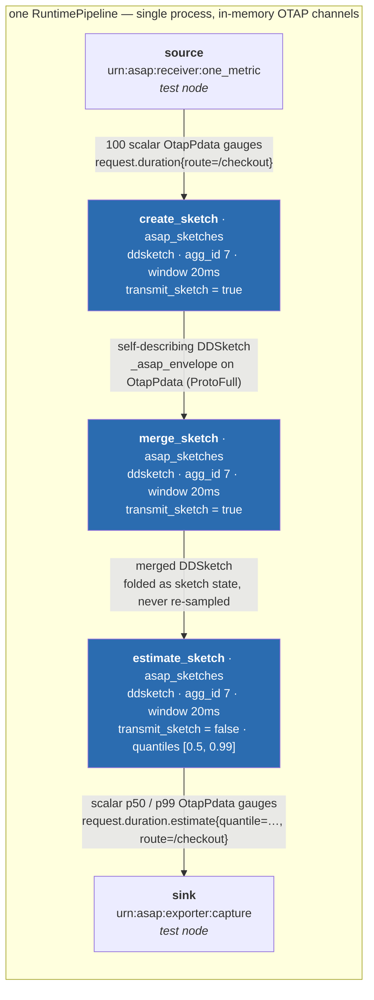

# ASAPCollector live OTAP pipeline demo

This guide demonstrates the `asap_sketches` processor running inside a real
OTAP Dataflow `RuntimePipeline`. The demo sends scalar OTAP metrics through
three independently configured dataflow processors: one creates a DDSketch,
one merges that self-describing sketch without expanding it back into samples,
and one estimates p50 and p99 as ordinary scalar OTAP metrics.

The demo is automated as an integration test so it is repeatable and ends with
a clear pass/fail result.

## What the demo proves

The test performs the following operations using the real OTAP engine APIs:

1. Parses an OTAP pipeline YAML document containing
   `urn:asap:processor:asap_sketches`.
2. Resolves the registered receiver, processor, and exporter factories.
3. Builds and starts an OTAP `RuntimePipeline`.
4. Injects 100 scalar `OtapPdata` values for `request.duration`, all carrying
   `route=/checkout`.
5. Creates a DDSketch and emits its self-describing payload through OTAP.
6. Decodes and merges that payload in a second processor as sketch state—not
   reconstructed scalar samples—and emits the merged sketch.
7. Merges the second payload in an estimate-mode processor and emits p50/p99
   scalar gauges.
8. Captures and decodes the exporter output.
9. Verifies p50/p99 accuracy, scalar output shape, metric name, and label
   preservation across all three processor hops.
10. Shuts down the running pipeline through OTAP's runtime control channel.

## Prerequisites

- Git.
- A current stable Rust toolchain with `cargo`.
- Network access on the first run so Cargo can fetch the pinned
  `open-telemetry/otel-arrow` and `asap_sketchlib` Git dependencies.
- The ASAPCollector repository checked out locally.

Confirm the tools are available:

```sh
git --version
rustc --version
cargo --version
```

The first build is relatively large because the `otap-engine` feature includes
the real OTAP Dataflow, Arrow, DataFusion, Tonic, and related dependencies.
Later runs reuse Cargo's build cache.

## Prepare the repository

From the repository root, update `main` and enter the Rust crate:

```sh
git switch main
git pull --ff-only
cd asap-precompute-rs
```

Optional: compile the demo before presenting so dependency downloads do not
interrupt the session:

```sh
cargo test --features otap-engine --test otap_pipeline_e2e --no-run
```

## Run the demo

Run only the live-pipeline scenario:

```sh
cargo test --features otap-engine \
  --test otap_pipeline_e2e \
  yaml_pipeline_creates_merges_and_estimates_a_sketch \
  -- --nocapture
```

A successful run ends with output similar to:

```text
running 1 test
test yaml_pipeline_creates_merges_and_estimates_a_sketch ... ok

test result: ok. 1 passed; 0 failed
```

The test normally takes approximately one second after compilation. It waits
long enough for the real processor timer to flush the sketch before requesting
pipeline shutdown.

## Show the pipeline configuration

Before running the command, show the YAML embedded in
[`tests/otap_pipeline_e2e.rs`](../asap-precompute-rs/tests/otap_pipeline_e2e.rs).
Its effective topology is:



Every edge is an in-process OTAP pipeline channel
(`effect_handler.send_message_with_source_node`) — there is no network hop in
this demo. `source` and `sink` are deterministic test nodes; the three
`asap_sketches` nodes, the YAML parser, factory registration, timer, runtime,
`OtapPdata` codec, and shutdown path are the real implementations.

The important processor portion of the YAML is:

```yaml
nodes:
  create_sketch:
    type: "urn:asap:processor:asap_sketches"
    config:
      sketch_type: "ddsketch"
      window_size: "20ms"
      output_metric_name: "request.duration.sketch"
      agg_id: 7
      sketch_params:
        relative_accuracy: 0.01
      transmit_sketch: true
  merge_sketch:
    type: "urn:asap:processor:asap_sketches"
    config:
      sketch_type: "ddsketch"
      window_size: "20ms"
      output_metric_name: "request.duration.merged_sketch"
      agg_id: 7
      sketch_params:
        relative_accuracy: 0.01
      transmit_sketch: true
  estimate_sketch:
    type: "urn:asap:processor:asap_sketches"
    config:
      sketch_type: "ddsketch"
      window_size: "20ms"
      output_metric_name: "request.duration.estimate"
      agg_id: 7
      sketch_params:
        relative_accuracy: 0.01
      transmit_sketch: false
      quantiles: [0.5, 0.99]
```

## Suggested presentation script

Use this short sequence during a live presentation:

1. Show the YAML and point out that the same stable processor URN takes three
   independent control-plane configs.
2. Explain that the input is an ordinary OTAP scalar metric—not a custom ASAP
   transport message.
3. Run the single-test command.
4. When it passes, explain that the assertion is made at the exporter boundary,
   after the metrics passed through creation, merge, estimate, and three real
   timer flushes.
5. Show the assertions near the end of `otap_pipeline_e2e.rs`: they check the
   p50/p99 relative accuracy, scalar output shape, output metric name, and the
   preserved `route` label.
6. Optionally run the full suite to show broader regression coverage.

## Run the full verification suite

To demonstrate that the live scenario integrates without breaking the other
sketch types, codecs, lifecycle behavior, and runtime semantics:

```sh
cargo test --features otap-engine
```

For code-quality verification:

```sh
cargo clippy --all-targets --features otap-engine -- -D warnings
cargo fmt --check
```

## Troubleshooting

### Git dependency fetch fails

Confirm that the machine can reach GitHub, then retry:

```sh
cargo fetch
```

The OTAP dependencies are pinned in `Cargo.toml`; no separate OTAP checkout or
manual file staging is required.

### The first build appears slow

This is expected for `otap-engine`. Prebuild with `--no-run` before the demo and
retain the `asap-precompute-rs/target` directory.

### The linker is terminated or reports insufficient memory

Close memory-intensive applications and reduce parallel build jobs:

```sh
CARGO_BUILD_JOBS=2 cargo test --features otap-engine \
  --test otap_pipeline_e2e \
  yaml_pipeline_creates_merges_and_estimates_a_sketch
```

### The test reports that no sketch was exported

Re-run the test once without additional system load. If it repeats, preserve
the complete command output: it indicates a regression in pipeline startup,
timer delivery, processor emission, or shutdown ordering rather than a missing
external service.

## Current boundary

This demo is a genuine running OTAP pipeline, but it is deliberately
self-contained: the source and sink are test nodes linked into the integration
test binary. It does not yet demonstrate separate hosts, an external OTLP
client, an external exporter backend, OpAMP configuration delivery, or
distributed shuffle.

Do not describe this demo as cross-host validation. The next presentation-level
milestone is a standalone engine process with an external OTLP sender and an
observable exporter, followed by a two-host producer/merger deployment. The
processor-local `NodeControlMsg::Config` path is implemented and tested, but a
real external OpAMP (or equivalent) control transport is still outside this
demo.
