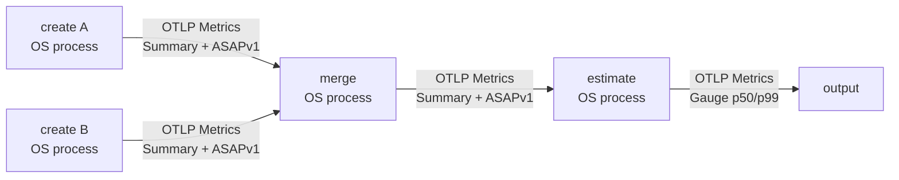

# ASAPCollector multi-process OTAP demo

The runnable demo executes four `urn:asap:processor:asap_sketches` dataflow
processors in four child OS processes: two creators, one merger, and one
estimator. Each child owns a real OTAP `RuntimePipeline`.



Process boundaries contain standard protobuf
`ExportMetricsServiceRequest` messages. Inside each worker the message is
native `OtapPdata`. Sketch state is an OTLP Summary data point whose
`sketch.envelope` bytes use asap_sketchlib's self-describing format and begin
with the `ASAPv1` magic bytes. The removed private sketch-stream batch format
is not used.

## Run

```sh
cd asap-precompute-rs
cargo run --bin asap-otap-demo --features otap-engine
```

The parent prints each child PID and only the final p50/p99 values. It does not
dump intermediate payloads to stdout.

## Official OTAP debugging output

Every worker inserts OTAP's official `urn:otel:processor:debug` after the ASAP
processor:

```yaml
debug:
  type: "urn:otel:processor:debug"
  config:
    verbosity: detailed
    mode: batch
    signals: [metrics]
    output: "/tmp/.../merge.debug.log"
```

This processor forwards the original pdata unchanged and writes OTAP's logical
OTLP view to a per-worker file. Detailed mode shows metric/data-point types,
Summary fields, and `sketch.*` attributes. The demo prints the trace directory
at completion. OTAP internal telemetry is useful for node throughput and
latency, but it does not replace payload/type inspection; the validation
exporter is intended for assertions rather than interactive tracing.

The official debug processor describes the logical OTLP view. It does not dump
the physical Arrow child schemas. The official console exporter can render
native OTAP and OTLP payloads, but it is a terminal sink, while the debug
processor is appropriate here because records must continue to the next
process boundary.

## Automated coverage

The existing integration scenario still verifies the four-processor graph in
one runtime:

```sh
cargo test --features otap-engine --test otap_pipeline_e2e
```

The runnable binary additionally asserts that the final output contains p50
and p99 after the four child processes finish successfully.
