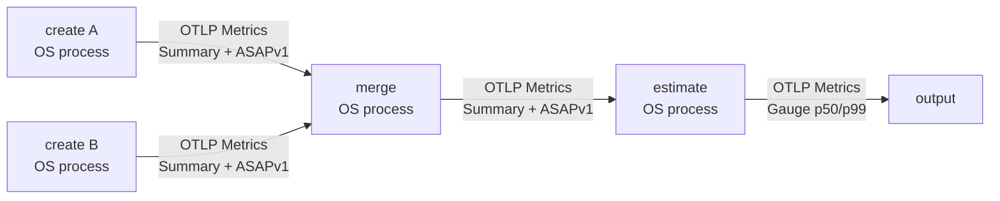

# ASAPCollector multi-process OTAP demo

The runnable demo executes four `urn:asap:processor:asap_sketches` dataflow
processors in four child OS processes: two creators, one merger, and one
estimator. Each child owns a real OTAP `RuntimePipeline`.


```mermaid
flowchart LR
  A["create A<br/>OS process"] -->|"OTLP Metrics<br/>Summary + ASAPv1"| M["merge<br/>OS process"]
  B["create B<br/>OS process"] -->|"OTLP Metrics<br/>Summary + ASAPv1"| M
  M -->|"OTLP Metrics<br/>Summary + ASAPv1"| E["estimate<br/>OS process"]
  E -->|"OTLP Metrics<br/>Gauge p50/p99"| O[output]
```

Process boundaries contain standard protobuf
`ExportMetricsServiceRequest` messages. Inside each worker the message is
native `OtapPdata`. Sketch state is an OTLP Summary data point whose
`sketch.envelope` bytes use asap_sketchlib's self-describing format and begin
with the `ASAPv1` magic bytes. The removed private sketch-stream batch format
is not used.

## Run

```sh
cd asap-precompute-rs
cargo run --bin asap-otap-demo --features otap-engine
```

The parent prints each child PID and only the final p50/p99 values. It does not
dump intermediate payloads to stdout.

## Official OTAP debugging output

Every worker inserts OTAP's official `urn:otel:processor:debug` after the ASAP
processor:

```yaml
debug:
  type: "urn:otel:processor:debug"
  config:
    verbosity: detailed
    mode: batch
    signals: [metrics]
    output: "/tmp/.../merge.debug.log"
```

This processor forwards the original pdata unchanged and writes OTAP's logical
OTLP view to a per-worker file. Detailed mode shows metric/data-point types,
Summary fields, and `sketch.*` attributes. The demo prints the trace directory
at completion. OTAP internal telemetry is useful for node throughput and
latency, but it does not replace payload/type inspection; the validation
exporter is intended for assertions rather than interactive tracing.

The official debug processor describes the logical OTLP view. It does not dump
the physical Arrow child schemas. The official console exporter can render
native OTAP and OTLP payloads, but it is a terminal sink, while the debug
processor is appropriate here because records must continue to the next
process boundary.

## Automated coverage

The existing integration scenario still verifies the four-processor graph in
one runtime:

```sh
cargo test --features otap-engine --test otap_pipeline_e2e
```

The runnable binary additionally asserts that the final output contains p50
and p99 after the four child processes finish successfully.

## Write KLL estimates to Prometheus and view them in Grafana

The optional export sends the validated estimator output as OTLP/HTTP protobuf
straight to Prometheus. Prometheus stores the gauges and Grafana queries them.
It requires `curl` (7.76 or newer) on the machine running the demo, plus Docker
Compose for the bundled backend. No additional collector is required.

From the repository root:

```sh
docker compose -f demos/kll-grafana/compose.yaml up -d
cd asap-precompute-rs
cargo run --bin asap-otap-demo --features otap-engine -- \
  --prometheus-otlp-endpoint http://localhost:9090/api/v1/otlp/v1/metrics
```

Open [the KLL dashboard](http://localhost:3000/d/asap-kll) (anonymous viewer
access is enabled for this local demo). The dashboard provisions its Prometheus
datasource automatically and displays p50/p99 using:

```promql
request_duration_estimate{quantile=~"0.5|0.99"}
```

The [Prometheus OTLP receiver](https://prometheus.io/docs/guides/opentelemetry/)
is enabled with `--web.enable-otlp-receiver`. Its default translation converts
`request.duration.estimate` to `request_duration_estimate` and retains the
`quantile` label. [Grafana provisioning](https://grafana.com/docs/grafana/latest/administration/provisioning/)
connects that datasource to the dashboard.

This is a finite demo: one run writes one sample per quantile. Repeat the
command to add samples to the time series. Instant queries show the latest
sample for Prometheus's default five-minute lookback; the history panel shows
previous samples within the selected time range. Values use the demo input's
units (the sequential input is synthetic). The outbound copy uses the current
wall-clock timestamp, so the synthetic 1970-era window remains available in
`out.otlp` and debug traces while the dashboard shows the completed estimate
now. Original gauge values, resource attributes, and point labels are preserved.
Series labels stored on OTAP scopes (including `quantile`) are also copied to
gauge point attributes, which Prometheus uses to identify separate series.
Only the `kll` scenario supports this option. HTTP errors, invalid OTLP
responses, and partial rejection fail the command; no automatic retry can
silently duplicate a partially accepted write.

To check the entire path after building the binary, run from the repository root:

```sh
python3 demos/kll-grafana/verify.py asap-precompute-rs/target/debug/asap-otap-demo
```

The check compares the printed estimates with Prometheus results and Grafana's
queries through its configured datasource, and verifies the dashboard exists.
Set `PROMETHEUS_PORT` and `GRAFANA_PORT` when starting Compose if the default
ports are occupied, and supply matching `--prometheus` / `--grafana` URLs to
the check. Services bind to localhost and data persists in Compose volumes.
Stop them with `docker compose -f demos/kll-grafana/compose.yaml down`; add `-v`
when you want to remove the demo's stored data.
