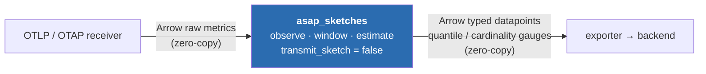
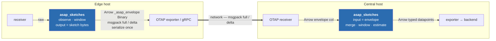
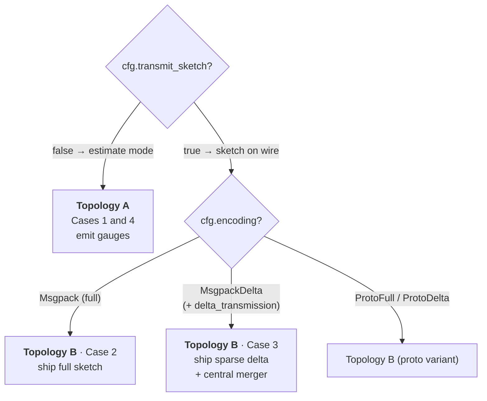

# `asap_sketches` dataflow-processor topologies

How the `asap_sketches` OTAP Dataflow processor is deployed, and what actually
crosses each edge. The whole design turns on one fact:

> Arrow zero-copy makes **raw metrics in** and **results out** free between
> local (thread-per-core) nodes — the buffers are `Arc`-backed, so a channel
> hop is a pointer + refcount bump, not a memcpy. But a **sketch is not a
> column**: the moment a value lands in a `DdSketch`/`Hll`/… it becomes opaque
> single-owner state that never rides a channel. Crossing a node boundary with
> a sketch therefore *always* costs one serialize (proto or **msgpack**).

Design rule: **keep every sketch inside the one node that owns its window
state; only ever let SUMMARIES (estimated datapoints) or SERIALIZED envelopes
leave. Split into a second processor only at a real tier/host boundary, where a
network hop already forces the serialize anyway.**

---

## The two topologies

There are exactly two shapes. The four "cases" below are these two shapes ×
an output knob.

### Topology A — edge-terminal (the sketch never leaves the node)

`transmit_sketch = false`: observe → window → **estimate at flush** → emit
typed metric datapoints. Nothing but small gauges leaves the node.



The sketch state lives inside `P`, owned, never on a channel. At `Wakeup`
(window close) the node reads each sketch and emits Gauge rows.

### Topology B — edge → central (ship the sketch, merge & estimate downstream)

`transmit_sketch = true`, `encoding = Msgpack | MsgpackDelta`: the edge ships
sketch bytes; a **second instance of the same processor** on the central tier
decodes, merges across edges, and estimates.



The only real network copy is the `==>` hop. Delta-encoding
(`MsgpackDelta`, per-window against-empty) shrinks it.

---

## The four cases

All four are the **same processor**, parameterized by two knobs —
`transmit_sketch` (sketch vs. estimate out) and `encoding` (proto vs. msgpack,
full vs. delta) — deployed once (terminal) or twice (edge + central).

| Case | Topology | Config | Compute in node | What crosses the boundary |
|---|---|---|---|---|
| **1** — insert → merge → estimate, ship results | A | `transmit_sketch=false`, `quantiles=[…]` | insert **+ merge inbound** + estimate | typed OTAP datapoints (gauges) |
| **2** — insert only, ship msgpack full | B (edge) | `transmit_sketch=true`, `encoding=Msgpack` | insert + window | `_asap_envelope` Binary — **msgpack full** |
| **3** — insert-merge, ship msgpack delta | B (edge **+** central) | `encoding=MsgpackDelta`, `delta_transmission=true` | insert (edge); merge + estimate (central) | `_asap_envelope` Binary — **msgpack delta** (edge); gauges (central) |
| **4** — insert + estimate, ship via metric types | A | `transmit_sketch=false` | insert + estimate | OTAP Gauge / Sum datapoints |

**Case 1 ⊇ Case 4:** same terminal node; Case 1 also folds *inbound* sketch
envelopes (`observe_envelope`), Case 4 is raw-in only.



---

## What each processor does (per-node)

```
process(msg):
  PData(batch)          -> ingest(batch)          # raw metrics OR inbound sketches
  Control(Wakeup)       -> flush()                # window close = the only emit
  Control(Config(plan)) -> update_config; ack
  Control(Shutdown)     -> flush()                # final drain

ingest(batch):
  flat = flatten(batch)                           # zero-copy Arrow projection
  input_mode == RawObs   -> for obs in decode_batch(flat):  pre.observe(obs)
  input_mode == Envelope -> for env in decode(flat):        pre.observe_envelope(env)

flush():   # serialize_series per closed series
  if !transmit_sketch:                            # ESTIMATE mode (Topology A)
     for p in sketch.estimate(quantiles):         # DDSketch/KLL: 1 gauge per quantile
        emit Gauge{ value=p.value, labels+=p.labels }   # HLL: 1 cardinality gauge
  else:                                           # SKETCH mode (Topology B)
     payload,enc = delta_transmission ? compute_delta(...) : snapshot()
     emit Envelope{ _asap_envelope=payload, encoding=enc }   # proto | msgpack (full/delta)
  effect_handler.send_message(batch)              # zero-copy hop downstream
```

---

## The zero-copy / serialization ledger

Every boundary and its true cost:

| Boundary | What moves | Cost |
|---|---|---|
| receiver → proc | raw metrics (OTAP Arrow) | **zero-copy** (`Arc` buffers, channel move) |
| decode inside proc | Arrow columns → `f64`/`bytes` → `sketch.update()` | **read-in-place**, no intermediate object |
| the windowed sketches | owned `asap_sketchlib` structs | **resident, never serialized while live** |
| inbound sketch (merge) | Binary col → prost/msgpack decode → struct → `merge()` | **one deserialize** per envelope |
| proc → next, **estimate mode** | small Arrow gauge batch (series × quantiles) | **one small alloc**, then zero-copy |
| proc → next, **sketch mode** | `to_msgpack()` / delta → bytes in Binary col | **one serialize** (sketch isn't columnar) |
| edge → central (gRPC) | the envelope batch | the **only real network copy**; delta shrinks it |
| control (`Wakeup`/`Config`/…) | tiny `NodeControlMsg` | negligible |

---

## Which computation is one processor vs. separate

- **Fused into one node** (all touch the single-owner window state — splitting
  would serialize the sketch across a channel): decode-raw, insert,
  merge-inbound-envelope, window rotation, estimate, encode-output.
- **A second processor only at the edge↔central tier boundary** (Case 3): the
  gRPC hop already forces a serialize, so nothing is lost. The central node is
  the *same* processor in `input=Envelope, output=Estimate` mode.
- **Stock OTAP nodes** around it — OTLP/OTAP receiver, OTAP/gRPC exporter,
  batch, retry, signal-router. Sketches ride the standard metrics batch in the
  `_asap_envelope` Binary carrier column, untouched by stock nodes.

---

## Implemented status (this repo)

- **Sketch-on-wire**: KLL in sketchlib's canonical self-describing ASAPv1
  MessagePack envelope. Private proto and legacy unframed MessagePack payloads
  are rejected at configuration time. Other algorithms remain usable in
  scalar estimate mode where implemented.
- **Estimate mode** (`transmit_sketch=false`): DDSketch / KLL emit one Gauge per
  configured quantile (`quantile` label); HLL emits a cardinality Gauge.
  CMS / CountSketch top-k output needs a heavy-hitter tracker (not yet built).
- **Cross-host merge**: KLL uses sketchlib's level-aware merge, preserving the
  logical weights of retained items after compaction.

Config knobs live on `PluginConfig` / `PrecomputeConfig`:
`encoding`, `delta_transmission`, `transmit_sketch`, `quantiles`.

---

## Code map

Each seam in the diagrams/pseudocode above, linked to source. Permalinks are
pinned to the merged commits (`ASAPCollector-public@1be24ef`,
`asap_sketchlib@0a2ac37`) so the line numbers don't drift.

### The OTAP node

| Seam | Source |
|---|---|
| `AsapSketchesProcessor` — the `local::Processor<OtapPdata>` node | [`otap-patch/all/mod.rs#L229`](https://github.com/ProjectASAP/ASAPCollector-public/blob/1be24ef1deeff38d79502d861291783fc34209d1/otap-patch/all/mod.rs#L229) |
| `process(msg, effect_handler)` — the PData / control dispatch | [`otap-patch/all/mod.rs#L244-L245`](https://github.com/ProjectASAP/ASAPCollector-public/blob/1be24ef1deeff38d79502d861291783fc34209d1/otap-patch/all/mod.rs#L244-L245) |

### Ingest (raw metrics or inbound sketches)

| Seam | Source |
|---|---|
| `flatten(records)` — sibling-batch → flat `RecordBatch` (zero-copy) | [`otap/records.rs#L187`](https://github.com/ProjectASAP/ASAPCollector-public/blob/1be24ef1deeff38d79502d861291783fc34209d1/asap-precompute-rs/src/otap/records.rs#L187) |
| `decode_batch(batch)` — Arrow columns → `Vec<Observation>` (read-in-place) | [`otap/decode.rs#L94`](https://github.com/ProjectASAP/ASAPCollector-public/blob/1be24ef1deeff38d79502d861291783fc34209d1/asap-precompute-rs/src/otap/decode.rs#L94) |
| `observe_envelope` ingest — routes `ProtoDelta`/`MsgpackDelta` vs full | [`window.rs#L265`](https://github.com/ProjectASAP/ASAPCollector-public/blob/1be24ef1deeff38d79502d861291783fc34209d1/asap-precompute-rs/src/window.rs#L265) |
| `Sketch::apply_delta_encoded(payload, enc)` — encoding-aware apply (default) | [`precompute.rs#L66`](https://github.com/ProjectASAP/ASAPCollector-public/blob/1be24ef1deeff38d79502d861291783fc34209d1/asap-precompute-rs/src/precompute.rs#L66) |
| …DDSketch override (proto vs msgpack dispatch) | [`sketches/ddsketch.rs#L263`](https://github.com/ProjectASAP/ASAPCollector-public/blob/1be24ef1deeff38d79502d861291783fc34209d1/asap-precompute-rs/src/sketches/ddsketch.rs#L263) |

### Flush / emit (`serialize_series` — the key seam)

| Seam | Source |
|---|---|
| `finish_rotate` — walks closed series, collects envelopes | [`precompute.rs#L465`](https://github.com/ProjectASAP/ASAPCollector-public/blob/1be24ef1deeff38d79502d861291783fc34209d1/asap-precompute-rs/src/precompute.rs#L465) |
| `serialize_series` — estimate branch **and** sketch-on-wire branch | [`precompute.rs#L499`](https://github.com/ProjectASAP/ASAPCollector-public/blob/1be24ef1deeff38d79502d861291783fc34209d1/asap-precompute-rs/src/precompute.rs#L499) |
| `full_encoding` / `delta_encoding` — `cfg.encoding` → emitted tag | [`precompute.rs#L610`](https://github.com/ProjectASAP/ASAPCollector-public/blob/1be24ef1deeff38d79502d861291783fc34209d1/asap-precompute-rs/src/precompute.rs#L610) · [`#L621`](https://github.com/ProjectASAP/ASAPCollector-public/blob/1be24ef1deeff38d79502d861291783fc34209d1/asap-precompute-rs/src/precompute.rs#L621) |
| `encode_batch` — writes the `value` column from `env.value` | [`otap/encode.rs#L104`](https://github.com/ProjectASAP/ASAPCollector-public/blob/1be24ef1deeff38d79502d861291783fc34209d1/asap-precompute-rs/src/otap/encode.rs#L104) |

### Estimate mode (Topology A)

| Seam | Source |
|---|---|
| `Sketch::estimate(quantiles, top_k)` — default empty | [`precompute.rs#L116`](https://github.com/ProjectASAP/ASAPCollector-public/blob/1be24ef1deeff38d79502d861291783fc34209d1/asap-precompute-rs/src/precompute.rs#L116) |
| `EstimatePoint { labels, value }` | [`precompute.rs#L209`](https://github.com/ProjectASAP/ASAPCollector-public/blob/1be24ef1deeff38d79502d861291783fc34209d1/asap-precompute-rs/src/precompute.rs#L209) |
| DDSketch estimate — one point per quantile | [`sketches/ddsketch.rs#L338`](https://github.com/ProjectASAP/ASAPCollector-public/blob/1be24ef1deeff38d79502d861291783fc34209d1/asap-precompute-rs/src/sketches/ddsketch.rs#L338) |
| KLL estimate — one point per quantile | [`sketches/kll.rs#L259`](https://github.com/ProjectASAP/ASAPCollector-public/blob/1be24ef1deeff38d79502d861291783fc34209d1/asap-precompute-rs/src/sketches/kll.rs#L259) |
| HLL estimate — single cardinality point | [`sketches/hll.rs#L290`](https://github.com/ProjectASAP/ASAPCollector-public/blob/1be24ef1deeff38d79502d861291783fc34209d1/asap-precompute-rs/src/sketches/hll.rs#L290) |

### Wire format & config knobs

| Seam | Source |
|---|---|
| `Encoding::MsgpackDelta` variant | [`envelope.rs#L95`](https://github.com/ProjectASAP/ASAPCollector-public/blob/1be24ef1deeff38d79502d861291783fc34209d1/asap-precompute-rs/src/envelope.rs#L95) |
| `Encoding::is_msgpack()` | [`envelope.rs#L113`](https://github.com/ProjectASAP/ASAPCollector-public/blob/1be24ef1deeff38d79502d861291783fc34209d1/asap-precompute-rs/src/envelope.rs#L113) |
| `SketchEnvelope::value` (estimate scalar) | [`envelope.rs#L214`](https://github.com/ProjectASAP/ASAPCollector-public/blob/1be24ef1deeff38d79502d861291783fc34209d1/asap-precompute-rs/src/envelope.rs#L214) |
| wrapper `wire_encoding` baked by the factory (`with_wire_encoding`) | [`sketches/ddsketch.rs#L61`](https://github.com/ProjectASAP/ASAPCollector-public/blob/1be24ef1deeff38d79502d861291783fc34209d1/asap-precompute-rs/src/sketches/ddsketch.rs#L61) |
| wrapper `snapshot` — proto vs msgpack dispatch | [`sketches/ddsketch.rs#L163`](https://github.com/ProjectASAP/ASAPCollector-public/blob/1be24ef1deeff38d79502d861291783fc34209d1/asap-precompute-rs/src/sketches/ddsketch.rs#L163) |
| `PluginConfig.encoding` (user-facing) → `resolve()` | [`otap/config.rs#L102`](https://github.com/ProjectASAP/ASAPCollector-public/blob/1be24ef1deeff38d79502d861291783fc34209d1/asap-precompute-rs/src/otap/config.rs#L102) · [`resolve #L164`](https://github.com/ProjectASAP/ASAPCollector-public/blob/1be24ef1deeff38d79502d861291783fc34209d1/asap-precompute-rs/src/otap/config.rs#L164) |
| `PrecomputeConfig.transmit_sketch` + manual `Default` (defaults `true`) | [`config.rs#L166`](https://github.com/ProjectASAP/ASAPCollector-public/blob/1be24ef1deeff38d79502d861291783fc34209d1/asap-precompute-rs/src/config.rs#L166) · [`Default #L275`](https://github.com/ProjectASAP/ASAPCollector-public/blob/1be24ef1deeff38d79502d861291783fc34209d1/asap-precompute-rs/src/config.rs#L275) |

### The msgpack format itself (`asap_sketchlib`)

| Seam | Source |
|---|---|
| `DdSketch::compute_delta_msgpack` (sparse bucket delta) | [`portable/ddsketch.rs#L282`](https://github.com/ProjectASAP/asap_sketchlib/blob/0a2ac3725f9b6d562f3ed7d9a48c6a1ae0c285e6/src/message_pack_format/portable/ddsketch.rs#L282) |
| `impl MessagePackCodec for DdSketchDelta` (parallel-array wire layout) | [`portable/ddsketch.rs#L465`](https://github.com/ProjectASAP/asap_sketchlib/blob/0a2ac3725f9b6d562f3ed7d9a48c6a1ae0c285e6/src/message_pack_format/portable/ddsketch.rs#L465) |
| `impl MessagePackCodec for KllSketchData` (KLL full form) | [`portable/kll.rs#L360`](https://github.com/ProjectASAP/asap_sketchlib/blob/0a2ac3725f9b6d562f3ed7d9a48c6a1ae0c285e6/src/message_pack_format/portable/kll.rs#L360) |
