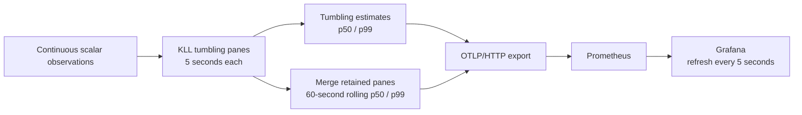
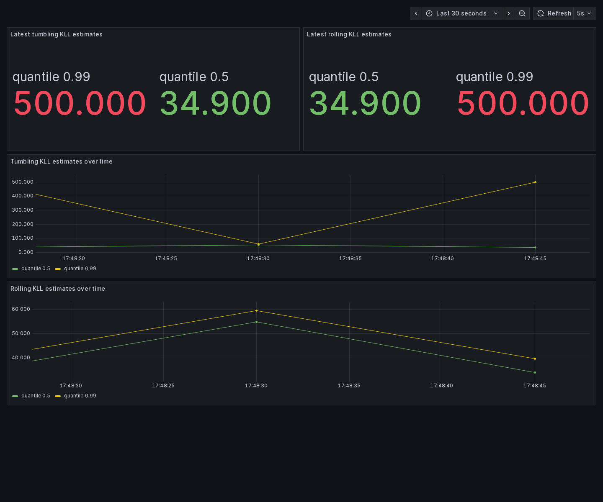

# Continuous KLL quantiles from mergeable tumbling panes

The persistent demo runs a real OTAP pipeline until Ctrl+C. It creates a KLL
sketch per disjoint tumbling pane, feeds the same pane stream to a tumbling
estimator and a rolling estimator, and continuously writes their p50/p99
gauges to Prometheus. Grafana refreshes both sets of panels every five seconds.



## Run the persistent demo

From the repository root:

```sh
docker compose -f demos/kll-grafana/compose.yaml up -d
cargo run --manifest-path asap-precompute-rs/Cargo.toml \
  --features otap-engine --bin asap-kll-stream-demo
```

Open <http://localhost:3000/d/asap-kll>. The default lookback is 60 seconds,
with a five-second pane/emission interval. The synthetic input changes its
latency distribution every ten seconds; tumbling and rolling estimates follow
that input at different rates. It generates about 2,000 observations per
second. Values are synthetic milliseconds, not measurements of this machine.

To compute a five-minute rolling quantile every five seconds:

```sh
cargo run --manifest-path asap-precompute-rs/Cargo.toml \
  --features otap-engine --bin asap-kll-stream-demo -- \
  --window-seconds 300 --slide-seconds 5
```

Use `--prometheus-otlp-endpoint URL` for another Prometheus instance and
`--run-seconds 60` for a bounded run. Without `--run-seconds`, the process stays
running until Ctrl+C. Shutdown does not publish incomplete panes or invent a
future window timestamp. HTTP/OTLP export failures terminate the demo.

The dashboard time picker controls displayed history; it does not change the
computed lookback. Change `--window-seconds` to change the rolling lookback.
The dashboard queries estimates that OTAP has already computed:

```promql
request_duration_estimate{quantile=~"0.5|0.99"}
request_duration_rolling_estimate{quantile=~"0.5|0.99"}
```

Each emission updates the same series with a new window-end timestamp.
`sketch.window_start_ms` and `sketch.window_end_ms` are removed from exported
point attributes because treating them as Prometheus labels would create new
series for every window. Series attributes, including `quantile`, are copied
from OTAP scope attributes onto points. Prometheus stores estimates; it does
not store the retained KLL panes or perform their merges.



The screenshot captures the running demo with a six-second lookback and
one-second panes, showing both modes receiving repeated samples.

## Configure an OTAP rolling estimator

This processor consumes scalar observations directly, or a stream of complete
ASAPv1 KLL panes of `window_slide` width:

```yaml
type: urn:asap:processor:asap_sketches
config:
  sketch_type: kll
  encoding: Msgpack
  window_size: 300s
  window_slide: 5s
  output_metric_name: request.duration.rolling_estimate
  agg_id: 7
  sketch_params: { k: 400 }
  transmit_sketch: false
  quantiles: [0.5, 0.99]
```

An upstream pane creator uses `window_size: 5s`, `window_slide: 5s`, and
`transmit_sketch: true`. Equal size and slide produce disjoint tumbling panes
that can be merged downstream. Overlapping sliding windows only emit scalar
estimates, preventing their overlapping sketches from being counted twice.
Omitting `window_slide` retains the original tumbling runtime behavior.

Pane boundaries align to Unix time and are half-open `[start, end)`. The
lookback must be an integer multiple of the pane width, and both durations
must be whole milliseconds. Sliding is currently KLL-only with full Msgpack
encoding, no delta transmission, and no late scalar updates to closed panes.
The first results use the observations available during warmup; a complete
lookback becomes available after the process has run for that duration.

For upstream sketch input, the estimator waits for a complete pane rather than
letting a wall-clock timer race ahead of delivery. An upstream producer must
provide each complete pane once. If several producers contribute to a pane,
merge their contributions before publishing that complete pane to the sliding
processor; this change does not introduce a distributed completeness barrier
or duplicate-delivery detection. A delayed pane within retained history can be
merged, but a previously emitted range is not retroactively republished.

## Query retained tumbling panes in Rust

The host-neutral `KllWindowStore` supports raw observations and merging full
upstream panes, plus reusable aligned range queries:

```rust
use std::time::Duration;
use asap_precompute_rs::{Encoding, PrecomputeConfig, SketchType};
use asap_precompute_rs::kll_windows::KllWindowStore;

let config = PrecomputeConfig {
    sketch_type: SketchType::KLLSketch,
    encoding: Encoding::Msgpack,
    quantiles: vec![0.5, 0.99],
    ..Default::default()
};
let mut panes = KllWindowStore::new(
    config, Duration::from_secs(5), Duration::from_secs(300),
)?;
// panes.observe(&observation)?;
// panes.merge_pane(&upstream_full_pane)?;
panes.advance(300_000);
let merged_sketches = panes.query(0, 300_000)?;
let quantile_gauges = panes.quantile_over_time(0, 300_000, &[0.5, 0.95, 0.99])?;
```

`query` returns one full merged KLL envelope per series; `quantile_over_time`
merges first and estimates the requested quantiles, which may vary per query.
Neither query consumes stored panes. Bounds must align to pane boundaries and
exclude open or expired panes. Unaligned ranges are rejected: a compacted
sketch cannot split a partially overlapping pane into exact observations.
Quantile accuracy remains approximate according to KLL's rank error, even
when temporal selection is exact at pane boundaries.

The store retains at most `retention / pane_width` completed panes plus the
active pane. Idle `advance` calls expire old state, and a configured
`max_series` cap applies across retained panes (new series are rejected at the
cap). Retained state is in memory; restarts discard it. The ASAPv1 KLL wrapper
retains compacted items without a raw-observation replay history.

This differs from applying PromQL `quantile_over_time` to an exported p99
series: that would compute a quantile of earlier p99 estimates. Here the KLLs
are merged with their compaction weights, so the result estimates the quantile
of all original observations in the selected panes.

## Verification

Start the Compose backend and build the persistent binary, then run:

```sh
python3 demos/kll-grafana/verify-streaming.py \
  asap-precompute-rs/target/debug/asap-kll-stream-demo
```

This runs a 16-second demo with a six-second lookback and one-second panes.
It verifies repeated writes for both quantiles in both modes, stable series
labels, changing rolling values, and matching queries through Grafana's
provisioned datasource. Alternative URLs use `--prometheus` and `--grafana`.

The runtime tests exercise aligned range merging, compacted unequal-size pane
weights, series identity, expiration, idle gaps, late data, invalid ranges,
upstream completion timing, and configuration changes:

```sh
cargo test --manifest-path asap-precompute-rs/Cargo.toml --test kll_windows
```
